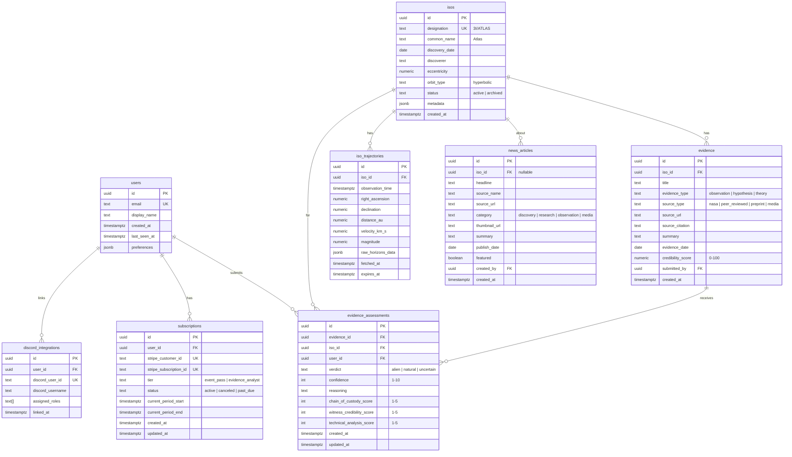

# ISO Tracker MVP - System Architecture Documentation

## Executive Summary

ISO Tracker is a modern, evidence-based analysis platform for interstellar objects, built as a Progressive Web Application (PWA) using Next.js 14, Supabase (PostgreSQL), and Stripe. The architecture follows a security-first, performance-optimized design that enables real-time ISO tracking, evidence-based analysis, and tiered subscription monetization.

**Key Architecture Characteristics:**
- **Cloud-Native**: Deployed on Vercel (frontend) + Supabase (backend/database), with automatic scaling and global CDN distribution
- **Security-First**: Row-Level Security (RLS) on all database tables, Content Security Policy with nonces (no unsafe-inline), Stripe webhook verification
- **Performance-Optimized**: React Server Components, Incremental Static Regeneration (ISR), materialized views for consensus calculations, <3s load time target
- **Evidence-Centric**: 3-tier evidence assessment framework (Chain of Custody, Witness Credibility, Technical Analysis) as PRIMARY differentiation

**Current Status**: Development - Phase 0 (Environment Setup) in progress

---

## System Overview

### High-Level Architecture

```
┌─────────────────────────────────────────────────────────────────────────────┐
│                           ISO Tracker Platform                              │
├─────────────────────────────────────────────────────────────────────────────┤
│                                                                             │
│  ┌─────────────────────────┐         ┌──────────────────────────────┐     │
│  │   Frontend (Next.js 14) │◄────────┤    Supabase Backend          │     │
│  │                         │  REST   │                              │     │
│  │ - React Server Comp.    │  API    │ - PostgreSQL (Row-Level Sec.)│     │
│  │ - TypeScript            │         │ - Authentication (JWT)       │     │
│  │ - Tailwind CSS          │         │ - Realtime Subscriptions     │     │
│  │ - Service Workers (PWA) │         │ - Edge Functions             │     │
│  └─────────────────────────┘         └──────────────────────────────┘     │
│             │                                     │                        │
│             │                                     │                        │
│             ▼                          ┌──────────▼──────────────┐         │
│  ┌─────────────────────┐               │  Supabase PostgreSQL    │         │
│  │  Vercel Edge CDN    │               │                         │         │
│  │  - Global delivery  │               │ - Evidence Framework DB │         │
│  │  - ISR caching      │               │ - User subscriptions    │         │
│  │  - Automatic HTTPS  │               │ - ISO tracking data     │         │
│  └─────────────────────┘               │ - RLS policies enforced │         │
│                                        └─────────────────────────┘         │
│                                                                             │
└─────────────────────────────────────────────────────────────────────────────┘

External Integrations:
┌──────────────────┐    ┌──────────────────┐    ┌─────────────────┐
│ NASA JPL Horizons│    │ Stripe Payments  │    │ Discord API     │
│ - Ephemeris data │    │ - Subscriptions  │    │ - Community     │
│ - Trajectory calc│    │ - Webhook events │    │ - Role sync     │
└──────────────────┘    └──────────────────┘    └─────────────────┘
```

### Architecture Principles

1. **Security-First Development** (Critical Requirement):
   - NEVER compromise security for convenience
   - Perform root cause analysis before implementing fixes
   - Maintain all security requirements (CSP, RLS, webhook verification)
   - Document security decisions with rationale

2. **Evidence Framework as Primary Feature**:
   - Not just tracking - evidence-based analysis is the core differentiator
   - 3-tier assessment rubric built into database schema
   - Materialized views for real-time consensus calculation
   - Tiered access to evidence submission (Evidence Analyst tier only)

3. **Performance Over Features**:
   - <3 second load time on 4G (Lighthouse Performance >90)
   - <500ms coordinate calculations (Web Workers + materialized views)
   - 7-day offline capability via PWA service workers
   - 60 FPS UI with debounced updates

4. **Monorepo for Solo Developer Efficiency**:
   - Single repository with shared TypeScript types
   - `/apps/web`, `/packages/database`, `/packages/ui` structure
   - Centralized dependency management (pnpm workspaces)
   - Simplified deployment and versioning

---

## Infrastructure Architecture

### Deployment Strategy

**Multi-Environment Deployment:**
- **Development**: Local + Supabase dev project (rapid iteration)
- **Staging**: Vercel staging + Supabase staging (pre-production validation)
- **Production**: Vercel production + Supabase production (live users)

### Infrastructure Components

#### Compute & Hosting (Vercel)

**Configuration:**
- **Platform**: Vercel (Next.js optimized, serverless functions)
- **Regions**: Global Edge CDN (automatic geographic distribution)
- **Framework**: Next.js 14 with App Router (React Server Components)
- **Build**: Automatic on git push (main → production, staging → staging)

**Scaling:**
- **Auto-Scaling**: Serverless functions scale automatically (0 → 10,000+ concurrent)
- **Edge Caching**: ISR + CDN for static content (99.99% cache hit rate target)
- **Cold Start**: <100ms for serverless functions (Next.js 14 optimization)

**Monitoring:**
- **Vercel Analytics**: Web Vitals (LCP, FID, CLS), real user monitoring
- **Sentry**: Error tracking with source maps, performance monitoring
- **Uptime**: Built-in health checks (99.9% uptime SLA)

#### Database & Backend (Supabase)

**Configuration:**
- **Database**: PostgreSQL 15 (Supabase managed)
- **Regions**: US East (primary), automatic backups
- **Connection Pooling**: PgBouncer (transaction mode, 100 connections)
- **Extensions**: PostGIS (future trajectory calculations), pg_stat_statements

**Scaling:**
- **Compute**: Dedicated instance (scalable from Small → 2XL)
- **Storage**: 8GB → 500GB+ (automatic expansion)
- **Read Replicas**: Available for Phase 3+ (high traffic scenarios)

**Backup Strategy:**
- **Frequency**: Daily automated backups (7-day retention)
- **Point-in-Time Recovery**: Available on Pro tier
- **Snapshots**: Manual snapshots before migrations
- **Disaster Recovery**: Multi-region replication (Phase 4)

**Security:**
- **Encryption at Rest**: AES-256 (Supabase default)
- **Encryption in Transit**: TLS 1.3 for all connections
- **Row-Level Security**: Enforced on ALL tables (critical requirement)
- **Connection**: JWT-based authentication, anon key for public access

#### Storage & CDN

**Static Assets:**
- **Provider**: Vercel Edge CDN (automatic, integrated)
- **Cache Strategy**: Immutable assets (versioned filenames), 1-year cache
- **Image Optimization**: Next.js Image component (automatic WebP, lazy loading)

**User-Generated Content:**
- **Provider**: Supabase Storage (future Phase 3 - observation photos)
- **Access Control**: RLS policies enforce tier-based access
- **CDN**: Automatic CDN distribution for public assets
- **Limits**: 50MB per upload, 1GB per user (Evidence Analyst tier)

#### Networking & DNS

**Domain Configuration:**
- **Primary Domain**: iso-tracker.app (production)
- **Staging Domain**: staging.iso-tracker.app (or Vercel auto-generated)
- **DNS Provider**: Vercel DNS (automatic SSL, zero-config)
- **SSL/TLS**: Automatic Let's Encrypt certificates, TLS 1.3

**Load Balancing:**
- **Strategy**: Vercel automatic geographic routing (Edge Network)
- **Failover**: Automatic fallback to nearest region
- **Rate Limiting**: Implemented at API route level (prevent abuse)

---

## Application Architecture

### Frontend Architecture

```
┌──────────────────────────────────────────────────────────────┐
│                   Next.js 14 Frontend                        │
├──────────────────────────────────────────────────────────────┤
│                                                              │
│  ┌─────────────────────────────────────────────────────┐   │
│  │              App Router (RSC)                       │   │
│  │                                                     │   │
│  │  /              Landing page (SSG)                 │   │
│  │  /pricing       Pricing tiers (SSG)                │   │
│  │  /dashboard     Evidence Framework (RSC + Client)  │   │
│  │  /track         ISO Tracking (Client-side)         │   │
│  │  /news          Curated news feed (ISR)            │   │
│  │  /api/*         Route Handlers (serverless)        │   │
│  └─────────────────────────────────────────────────────┘   │
│                                                              │
│  ┌─────────────────────────────────────────────────────┐   │
│  │          Component Architecture                     │   │
│  │                                                     │   │
│  │  Server Components (Default):                      │   │
│  │  - EvidenceTimeline (data fetching)               │   │
│  │  - NewsFeed (ISR cached)                          │   │
│  │  - UserProfile (auth-based)                       │   │
│  │                                                     │   │
│  │  Client Components ("use client"):                │   │
│  │  - SkyMap2D (Canvas rendering, WebGL)            │   │
│  │  - SentimentConsensusChart (D3.js/Recharts)      │   │
│  │  - AssessmentForm (real-time validation)         │   │
│  │  - TimelineSlider (user interaction)             │   │
│  └─────────────────────────────────────────────────────┘   │
│                                                              │
│  ┌─────────────────────────────────────────────────────┐   │
│  │          State Management                           │   │
│  │                                                     │   │
│  │  - Zustand (client state, user preferences)       │   │
│  │  - React Server Components (server state)         │   │
│  │  - Supabase Realtime (consensus updates)          │   │
│  │  - Service Worker (offline queue)                 │   │
│  └─────────────────────────────────────────────────────┘   │
│                                                              │
└──────────────────────────────────────────────────────────────┘
```

**Technology Stack:**
- **Framework**: Next.js 14 (App Router, React Server Components)
- **Language**: TypeScript 5.3+ (strict mode enabled)
- **Styling**: Tailwind CSS 3.4+ (utility-first, custom design system)
- **UI Components**: shadcn/ui (Radix primitives, accessible)
- **State Management**: Zustand (client state) + RSC (server state)
- **Data Fetching**: Server Components (fetch with caching) + SWR (client-side)
- **Build Tools**: Next.js built-in (Turbopack for dev, Webpack for production)

**Key Frontend Patterns:**

1. **Server Components by Default**:
   - Data-heavy components rendered on server (reduces client JS)
   - Streaming SSR for faster Time to First Byte (TTFB)
   - Example: `EvidenceTimeline` fetches data server-side, streams to client

2. **Client Components for Interactivity**:
   - Only components requiring browser APIs or user interaction
   - Example: `SkyMap2D` uses Canvas API, must be client-side
   - Minimize client bundle size (<200KB gzipped target)

3. **Progressive Enhancement**:
   - Core functionality works without JavaScript (forms submit, links navigate)
   - Enhanced with client-side validation and optimistic updates
   - Offline support via service workers (Phase 1)

### Backend Architecture

```
┌──────────────────────────────────────────────────────────────┐
│                   Supabase Backend                           │
├──────────────────────────────────────────────────────────────┤
│                                                              │
│  ┌─────────────────────────────────────────────────────┐   │
│  │        Authentication (Supabase Auth)               │   │
│  │                                                     │   │
│  │  - JWT tokens (access + refresh)                   │   │
│  │  - Email/password (primary method)                 │   │
│  │  - OAuth (Google, GitHub - Phase 2)               │   │
│  │  - Magic links (passwordless option)              │   │
│  └─────────────────────────────────────────────────────┘   │
│                           │                                  │
│                           ▼                                  │
│  ┌─────────────────────────────────────────────────────┐   │
│  │        Authorization (Row-Level Security)           │   │
│  │                                                     │   │
│  │  Policy: evidence_assessments_select               │   │
│  │    → auth.uid() IS NOT NULL (authenticated users)  │   │
│  │                                                     │   │
│  │  Policy: evidence_assessments_insert               │   │
│  │    → check_tier(auth.uid(), 'evidence_analyst')   │   │
│  │                                                     │   │
│  │  Policy: subscriptions_select                      │   │
│  │    → auth.uid() = user_id (own data only)         │   │
│  └─────────────────────────────────────────────────────┘   │
│                           │                                  │
│                           ▼                                  │
│  ┌─────────────────────────────────────────────────────┐   │
│  │        Database Access (PostgreSQL)                 │   │
│  │                                                     │   │
│  │  - Connection pooling (PgBouncer)                 │   │
│  │  - Prepared statements (SQL injection protection) │   │
│  │  - Query optimization (indexes, materialized views)│   │
│  └─────────────────────────────────────────────────────┘   │
│                                                              │
│  ┌─────────────────────────────────────────────────────┐   │
│  │        Realtime Subscriptions                       │   │
│  │                                                     │   │
│  │  - WebSocket connections (auth required)          │   │
│  │  - PostgreSQL change streams (LISTEN/NOTIFY)      │   │
│  │  - Example: consensus_snapshot updates            │   │
│  └─────────────────────────────────────────────────────┘   │
│                                                              │
└──────────────────────────────────────────────────────────────┘

┌──────────────────────────────────────────────────────────────┐
│              Next.js API Routes (Route Handlers)             │
├──────────────────────────────────────────────────────────────┤
│                                                              │
│  /api/evidence/[isoId]       → GET evidence timeline        │
│  /api/evidence/assessments   → POST new assessment          │
│  /api/evidence/consensus/[isoId] → GET consensus data       │
│  /api/nasa/trajectory/[isoId] → GET + cache trajectory      │
│  /api/stripe/create-checkout-session → Redirect to Stripe   │
│  /api/stripe/create-portal-session → Customer Portal        │
│  /api/webhooks/stripe        → Handle subscription events   │
│  /api/discord/invite         → Generate Discord invite      │
│  /api/news                   → GET news feed (paginated)    │
│                                                              │
└──────────────────────────────────────────────────────────────┘
```

**Technology Stack:**
- **Runtime**: Node.js 20+ (Vercel serverless functions)
- **Framework**: Next.js Route Handlers (App Router API routes)
- **Database Client**: Supabase JS Client v2 (TypeScript SDK)
- **Authentication**: Supabase Auth (JWT verification)
- **API Design**: REST (JSON responses, standard HTTP methods)
- **Validation**: Zod (runtime type checking, input validation)

**Key Backend Patterns:**

1. **Route Handlers as Thin Layer**:
   - API routes delegate to Supabase (database logic in SQL/RLS policies)
   - Minimal business logic in JavaScript (leverage PostgreSQL)
   - Example: Evidence assessment validation in RLS policy, not JS

2. **Row-Level Security (RLS) for Authorization**:
   - ALL tables have RLS enabled (critical security requirement)
   - Policies enforce tier-based access (Event Pass vs Evidence Analyst)
   - Example: Only Evidence Analysts can INSERT into evidence_assessments

3. **Caching Strategy**:
   - Server Component caching (Next.js fetch with `next: { revalidate: 3600 }`)
   - Materialized views for expensive queries (consensus calculations)
   - Edge caching via ISR (news feed, static pages)

### Shared Architecture (Monorepo Packages)

**`/packages/database`**:
- **Purpose**: Database schema, migrations, types
- **Contents**:
  - `schema.sql` - Complete PostgreSQL schema
  - `migrations/` - Timestamped migration files
  - `types.ts` - Generated TypeScript types from schema
  - `seed.sql` - Sample data for development

**`/packages/ui`**:
- **Purpose**: Reusable UI components (design system)
- **Contents**:
  - `components/` - shadcn/ui components (Button, Card, etc.)
  - `styles/` - Tailwind config, global CSS
  - `icons/` - SVG icon components

**`/packages/utils`**:
- **Purpose**: Shared utilities and helpers
- **Contents**:
  - `astronomy.ts` - Coordinate conversion (RA/Dec → Alt/Az)
  - `validation.ts` - Zod schemas for API validation
  - `formatting.ts` - Date, number, string formatting

---

## Data Architecture

### Database Schema Design (PostgreSQL)



### Materialized View: Consensus Snapshot

**Purpose**: Pre-calculate consensus statistics for real-time dashboard display without expensive aggregations on every request.

```sql
CREATE MATERIALIZED VIEW consensus_snapshot AS
SELECT
    ea.iso_id,
    COUNT(*) AS total_assessments,

    -- Community Sentiment (all users)
    COUNT(*) FILTER (WHERE ea.verdict = 'alien') AS community_alien_count,
    COUNT(*) FILTER (WHERE ea.verdict = 'natural') AS community_natural_count,
    COUNT(*) FILTER (WHERE ea.verdict = 'uncertain') AS community_uncertain_count,
    ROUND(100.0 * COUNT(*) FILTER (WHERE ea.verdict = 'alien') / COUNT(*), 1) AS community_alien_pct,
    ROUND(100.0 * COUNT(*) FILTER (WHERE ea.verdict = 'natural') / COUNT(*), 1) AS community_natural_pct,

    -- Scientific Consensus (Evidence Analysts only)
    COUNT(*) FILTER (WHERE s.tier = 'evidence_analyst') AS analyst_count,
    COUNT(*) FILTER (WHERE s.tier = 'evidence_analyst' AND ea.verdict = 'alien') AS analyst_alien_count,
    COUNT(*) FILTER (WHERE s.tier = 'evidence_analyst' AND ea.verdict = 'natural') AS analyst_natural_count,
    ROUND(100.0 * COUNT(*) FILTER (WHERE s.tier = 'evidence_analyst' AND ea.verdict = 'natural') /
          NULLIF(COUNT(*) FILTER (WHERE s.tier = 'evidence_analyst'), 0), 1) AS analyst_natural_pct,

    -- Average scores (Evidence Analysts only)
    ROUND(AVG(ea.chain_of_custody_score) FILTER (WHERE s.tier = 'evidence_analyst'), 2) AS avg_custody_score,
    ROUND(AVG(ea.witness_credibility_score) FILTER (WHERE s.tier = 'evidence_analyst'), 2) AS avg_credibility_score,
    ROUND(AVG(ea.technical_analysis_score) FILTER (WHERE s.tier = 'evidence_analyst'), 2) AS avg_technical_score,

    MAX(ea.updated_at) AS last_assessment_at
FROM evidence_assessments ea
LEFT JOIN subscriptions s ON ea.user_id = s.user_id AND s.status = 'active'
GROUP BY ea.iso_id;

-- Refresh every 5 minutes (called via cron job or Edge Function)
CREATE UNIQUE INDEX ON consensus_snapshot (iso_id);
REFRESH MATERIALIZED VIEW CONCURRENTLY consensus_snapshot;
```

### Key Data Models

#### Evidence Assessment (PRIMARY FEATURE)

**Purpose**: Store user assessments of ISO evidence using 3-tier rubric.

**Key Fields**:
- `verdict`: User's conclusion (alien | natural | uncertain)
- `confidence`: User's confidence level (1-10 scale)
- `chain_of_custody_score`: Data integrity assessment (1-5)
- `witness_credibility_score`: Source reliability assessment (1-5)
- `technical_analysis_score`: Scientific rigor assessment (1-5)
- `reasoning`: User's written justification (required for Evidence Analysts)

**Relationships**:
- Belongs to `evidence` (which evidence point being assessed)
- Belongs to `iso` (which ISO this assessment is for)
- Belongs to `user` (who submitted this assessment)

**RLS Policies**:
```sql
-- Anyone authenticated can VIEW assessments
CREATE POLICY "Anyone can view assessments"
ON evidence_assessments FOR SELECT
USING (auth.uid() IS NOT NULL);

-- Only Evidence Analysts can INSERT assessments
CREATE POLICY "Evidence Analysts can submit assessments"
ON evidence_assessments FOR INSERT
WITH CHECK (
    EXISTS (
        SELECT 1 FROM subscriptions
        WHERE user_id = auth.uid()
        AND tier = 'evidence_analyst'
        AND status = 'active'
    )
);

-- Users can UPDATE their own assessments
CREATE POLICY "Users can update own assessments"
ON evidence_assessments FOR UPDATE
USING (user_id = auth.uid());
```

#### Subscription (MONETIZATION)

**Purpose**: Track user subscription tier and Stripe integration.

**Key Fields**:
- `tier`: Subscription level (event_pass | evidence_analyst)
- `status`: Current state (active | canceled | past_due)
- `stripe_customer_id`: Link to Stripe customer
- `stripe_subscription_id`: Link to Stripe subscription
- `current_period_end`: When subscription renews/expires

**Relationships**:
- Belongs to `user` (one user can have one active subscription)
- Referenced by RLS policies (tier-based feature access)

**RLS Policies**:
```sql
-- Users can only view their own subscription
CREATE POLICY "Users can view own subscription"
ON subscriptions FOR SELECT
USING (user_id = auth.uid());

-- Only system (service role) can INSERT/UPDATE (via Stripe webhooks)
-- No user-facing INSERT/UPDATE policies
```

#### ISO Trajectory (TRACKING)

**Purpose**: Cache NASA JPL Horizons data for offline capability and performance.

**Key Fields**:
- `observation_time`: Timestamp for this coordinate snapshot
- `right_ascension` / `declination`: Celestial coordinates (J2000)
- `distance_au`: Distance from Sun in Astronomical Units
- `velocity_km_s`: Velocity relative to Sun
- `magnitude`: Apparent brightness (lower = brighter)
- `expires_at`: When to refetch from NASA (24-hour TTL)

**Caching Strategy**:
- Fetch ±30 days of trajectory data from NASA on first request
- Store in database with 24-hour expiration
- Serve from cache for subsequent requests (reduces NASA API calls)
- Background job refreshes before expiration (Phase 2)

### Data Flow Architecture

```
User Request Flow (Evidence Assessment):

1. User clicks "Submit Assessment" (Client Component)
   │
   ├──> Optimistic Update (Zustand state + UI reflects submission immediately)
   │
   ├──> POST /api/evidence/assessments
   │     │
   │     ├──> Validate JWT token (Supabase Auth)
   │     ├──> Validate input schema (Zod)
   │     ├──> Check tier via RLS policy (must be Evidence Analyst)
   │     ├──> INSERT into evidence_assessments table
   │     └──> Return { success: true, assessment_id }
   │
   ├──> On Success:
   │     ├──> Broadcast change via Supabase Realtime (WebSocket)
   │     ├──> Other connected clients receive update
   │     └──> Trigger materialized view refresh (if needed)
   │
   └──> On Error:
         ├──> Rollback optimistic update
         ├──> Show error toast (tier paywall if not Evidence Analyst)
         └──> Log error to Sentry

---

NASA Trajectory Fetch Flow:

1. User opens /track/3I-ATLAS (Server Component)
   │
   ├──> Check cache: SELECT * FROM iso_trajectories WHERE iso_id = '...' AND expires_at > NOW()
   │
   ├──> If cached and fresh:
   │     └──> Return cached data (0ms database query)
   │
   └──> If expired or missing:
         │
         ├──> Fetch from NASA JPL Horizons API (telnet interface or HTTP API)
         ├──> Parse ephemeris data (parse RA/Dec, distance, magnitude)
         ├──> INSERT into iso_trajectories with expires_at = NOW() + INTERVAL '24 hours'
         ├──> Return fresh data
         └──> Background: Preload ±30 days of data for timeline slider

---

Stripe Webhook Flow (Subscription Sync):

1. Stripe sends webhook event (e.g., customer.subscription.updated)
   │
   ├──> POST /api/webhooks/stripe
   │     │
   │     ├──> Verify signature (Stripe webhook secret, CRITICAL security)
   │     ├──> Parse event payload
   │     │
   │     ├──> Handle event type:
   │     │     ├──> checkout.session.completed → Create user + subscription
   │     │     ├──> customer.subscription.updated → Update tier/status
   │     │     └──> customer.subscription.deleted → Set status = 'canceled'
   │     │
   │     ├──> UPSERT subscriptions table
   │     └──> Return 200 OK (acknowledge receipt)
   │
   └──> Next user request:
         └──> RLS policies use updated tier (instant access/restriction)
```

---

## Security Architecture

### Authentication & Authorization

**Implementation:**

**Authentication Method**: Supabase Auth (JWT tokens)
- **Access Token**: Short-lived (1 hour), used for API requests
- **Refresh Token**: Long-lived (30 days), rotates on use
- **Session Management**: Stored in httpOnly cookies (XSS protection)
- **Password Requirements**: Min 8 characters, no complexity rules (encourage passphrases)

**Authorization Model**: Row-Level Security (RLS) + Tier-Based Access Control
- **RLS Policies**: Enforce at database level (cannot be bypassed by application code)
- **Tier Checking**: Function `check_tier(user_id, required_tier) RETURNS BOOLEAN`
- **Role Hierarchy**: Evidence Analyst > Event Pass > Free (higher tiers inherit lower tier access)

**Authorization Matrix:**

```
Feature/Tier              │ Free │ Event Pass │ Evidence Analyst
──────────────────────────┼──────┼────────────┼─────────────────
View ISO Tracking         │  ✅  │     ✅     │        ✅
Real-Time Position Updates│  ❌  │     ✅     │        ✅
View Evidence Timeline    │  ✅  │     ✅     │        ✅
View Consensus Dashboard  │  ✅  │     ✅     │        ✅
Submit Evidence Assessment│  ❌  │     ❌     │        ✅
Submit New Evidence       │  ❌  │     ❌     │        ✅
Access Educational Content│  ❌  │     ❌     │        ✅
Export Data (API Access)  │  ❌  │     ❌     │        ✅
Discord Analyst Channel   │  ❌  │     ❌     │        ✅
```

### Security Measures

#### Content Security Policy (CSP)

**Critical Requirement**: NO `unsafe-inline` - use nonces for inline scripts.

```typescript
// next.config.js - CSP Headers
const cspHeader = `
    default-src 'self';
    script-src 'self' 'nonce-${NONCE}' https://js.stripe.com;
    style-src 'self' 'nonce-${NONCE}';
    img-src 'self' blob: data: https://*.supabase.co https://vercel.com;
    font-src 'self';
    object-src 'none';
    base-uri 'self';
    form-action 'self';
    frame-ancestors 'none';
    upgrade-insecure-requests;
`

// Middleware generates nonce per request
export async function middleware(request: NextRequest) {
  const nonce = Buffer.from(crypto.randomUUID()).toString('base64')
  const cspHeaderValue = cspHeader.replace(/NONCE/g, nonce)

  const response = NextResponse.next({
    request: {
      headers: request.headers,
    },
  })

  response.headers.set('Content-Security-Policy', cspHeaderValue)
  response.headers.set('X-Nonce', nonce)

  return response
}
```

**Usage in Components**:
```tsx
// Server Component - inject nonce into inline script
export default function Page() {
  const nonce = headers().get('X-Nonce')

  return (
    <>
      <script nonce={nonce} dangerouslySetInnerHTML={{
        __html: `console.log('Allowed with nonce')`
      }} />
    </>
  )
}
```

#### API Security

**Rate Limiting**:
- **Strategy**: Token bucket algorithm (Upstash Redis or Vercel KV)
- **Limits**:
  - Free tier: 10 requests/minute per IP
  - Event Pass: 60 requests/minute per user
  - Evidence Analyst: 120 requests/minute per user
  - Stripe webhooks: Unlimited (signature-verified)
- **Response**: 429 Too Many Requests with `Retry-After` header

**Input Validation** (Zod Schemas):
```typescript
// Evidence assessment validation
const AssessmentSchema = z.object({
  evidence_id: z.string().uuid(),
  iso_id: z.string().uuid(),
  verdict: z.enum(['alien', 'natural', 'uncertain']),
  confidence: z.number().int().min(1).max(10),
  chain_of_custody_score: z.number().int().min(1).max(5),
  witness_credibility_score: z.number().int().min(1).max(5),
  technical_analysis_score: z.number().int().min(1).max(5),
  reasoning: z.string().min(50).max(2000), // Require thoughtful explanation
})

// API route validates before database insert
export async function POST(request: Request) {
  const body = await request.json()
  const validated = AssessmentSchema.parse(body) // Throws if invalid
  // ... proceed with insert
}
```

**CORS Policy**:
- **Allowed Origins**: iso-tracker.app, staging.iso-tracker.app (production + staging only)
- **Allowed Methods**: GET, POST, PUT, DELETE, OPTIONS
- **Allowed Headers**: Content-Type, Authorization
- **Credentials**: Include (cookies allowed for same-origin)

**API Keys** (Future Phase 4 - Research API):
- **Management**: Generated per user in settings, hashed in database
- **Format**: `iso_live_` prefix + 32 random characters
- **Rotation**: User can revoke/regenerate at any time
- **Scoping**: Read-only access to evidence and trajectory data

#### Stripe Webhook Security (CRITICAL)

**Webhook Signature Verification**:
```typescript
// /api/webhooks/stripe/route.ts
import { headers } from 'next/headers'
import Stripe from 'stripe'

const stripe = new Stripe(process.env.STRIPE_SECRET_KEY!)

export async function POST(request: Request) {
  const body = await request.text()
  const signature = headers().get('stripe-signature')

  if (!signature) {
    return new Response('No signature', { status: 400 })
  }

  let event: Stripe.Event

  try {
    // CRITICAL: Verify signature before processing
    event = stripe.webhooks.constructEvent(
      body,
      signature,
      process.env.STRIPE_WEBHOOK_SECRET!
    )
  } catch (err) {
    console.error('Webhook signature verification failed:', err.message)
    return new Response('Invalid signature', { status: 400 })
  }

  // Now safe to process event (verified from Stripe)
  switch (event.type) {
    case 'customer.subscription.updated':
      await handleSubscriptionUpdate(event.data.object)
      break
    // ... other event handlers
  }

  return new Response('OK', { status: 200 })
}
```

**Why This Matters**:
- Without verification, attackers could send fake webhook events
- Could grant themselves Evidence Analyst tier without payment
- Could delete subscriptions for real users
- **This is a critical security requirement - NEVER skip signature verification**

#### Data Protection

**Encryption at Rest**: AES-256 (Supabase default, transparent to application)

**Encryption in Transit**: TLS 1.3 for all connections
- Vercel: Automatic HTTPS (Let's Encrypt certificates)
- Supabase: Enforced TLS for database connections
- Stripe: TLS 1.2+ required for API calls

**PII Handling**:
- **Email**: Stored in Supabase Auth (separate from public users table)
- **Payment Info**: NEVER stored (Stripe handles, PCI compliant)
- **Display Name**: User-controlled, optional (no real name required)
- **Location**: IP-based geolocation for tracking, not stored permanently

**Compliance**:
- **GDPR**: Right to deletion (user can delete account → cascades all data)
- **CCPA**: Data export (user can download all assessments/data as JSON)
- **Privacy Policy**: Required before Phase 1 launch (legal review)

---

## Integration Architecture

### External Service Integrations

#### NASA JPL Horizons API

```
Integration Flow:
┌────────────────┐         ┌─────────────────────┐         ┌──────────────┐
│  ISO Tracker   │ Request │  NASA JPL Horizons  │ Parse   │  Database    │
│  (Next.js API) │────────>│  Telnet/Web API     │────────>│  (Cache)     │
│                │ RA/Dec  │                     │ Store   │              │
└────────────────┘         └─────────────────────┘         └──────────────┘
```

**Provider**: NASA Jet Propulsion Laboratory (free, public API)

**Integration Type**: HTTP API (primary) + Telnet (fallback)
- **Endpoint**: https://ssd.jpl.nasa.gov/api/horizons.api
- **Authentication**: None (public API, no rate limits documented)
- **Format**: Plain text ephemeris tables

**Key Operations**:
1. **Fetch Ephemeris**: Get position data for date range (±30 days from today)
2. **Parse Response**: Extract RA, Dec, distance, velocity, magnitude
3. **Coordinate Conversion**: Transform to observer's local coordinates (Alt/Az)

**Example Request**:
```bash
curl "https://ssd.jpl.nasa.gov/api/horizons.api?format=text&COMMAND='C/2024 S1'&OBJ_DATA='YES'&MAKE_EPHEM='YES'&EPHEM_TYPE='OBSERVER'&CENTER='500@399'&START_TIME='2025-01-01'&STOP_TIME='2025-01-31'&STEP_SIZE='1 d'"
```

**Caching Strategy**:
- **TTL**: 24 hours (trajectories change slowly, daily updates sufficient)
- **Storage**: `iso_trajectories` table in PostgreSQL
- **Invalidation**: Automatic via `expires_at` timestamp
- **Preload**: Fetch ±30 days on first request (enables timeline slider)

**Error Handling**:
- **503 Service Unavailable**: Retry with exponential backoff (5s, 10s, 30s)
- **Invalid Object**: Return user-friendly error ("ISO not found in NASA database")
- **Parse Errors**: Log to Sentry, return cached data if available
- **Timeout**: 10-second request timeout, fallback to last cached data

---

#### Stripe Payments & Subscriptions

```
Integration Flow:
┌────────────────┐         ┌─────────────────────┐         ┌──────────────┐
│  User clicks   │ Redirect│  Stripe Checkout    │ Webhook │  ISO Tracker │
│  "Subscribe"   │────────>│  (Hosted Page)      │────────>│  /api/webhook│
│                │         │                     │ Events  │              │
└────────────────┘         └─────────────────────┘         └──────────────┘
```

**Provider**: Stripe (99.99% uptime SLA)

**Integration Type**: Stripe Checkout (hosted) + Stripe Billing + Webhooks

**Authentication**: API keys (publishable key for client, secret key for server)

**Key Operations**:

1. **Create Checkout Session** (`/api/stripe/create-checkout-session`):
```typescript
const session = await stripe.checkout.sessions.create({
  customer_email: user.email,
  line_items: [{
    price: 'price_1234567890', // Event Pass or Evidence Analyst price ID
    quantity: 1,
  }],
  mode: 'subscription',
  success_url: `${process.env.NEXT_PUBLIC_URL}/onboarding?session_id={CHECKOUT_SESSION_ID}`,
  cancel_url: `${process.env.NEXT_PUBLIC_URL}/pricing`,
  metadata: {
    user_id: user.id, // Link to our user table
  },
})

return Response.redirect(session.url) // Redirect to Stripe
```

2. **Handle Webhook Events** (`/api/webhooks/stripe`):
```typescript
switch (event.type) {
  case 'checkout.session.completed':
    // New subscription created
    const session = event.data.object
    await supabase.from('subscriptions').insert({
      user_id: session.metadata.user_id,
      stripe_customer_id: session.customer,
      stripe_subscription_id: session.subscription,
      tier: determineTier(session.line_items), // event_pass or evidence_analyst
      status: 'active',
    })
    break

  case 'customer.subscription.updated':
    // Subscription changed (upgrade/downgrade/renewal)
    const subscription = event.data.object
    await supabase.from('subscriptions')
      .update({
        tier: determineTier(subscription.items.data),
        status: subscription.status,
        current_period_end: new Date(subscription.current_period_end * 1000),
      })
      .eq('stripe_subscription_id', subscription.id)
    break

  case 'customer.subscription.deleted':
    // Subscription canceled
    await supabase.from('subscriptions')
      .update({ status: 'canceled' })
      .eq('stripe_subscription_id', event.data.object.id)
    break
}
```

3. **Customer Portal** (`/api/stripe/create-portal-session`):
```typescript
const session = await stripe.billingPortal.sessions.create({
  customer: subscription.stripe_customer_id,
  return_url: `${process.env.NEXT_PUBLIC_URL}/account`,
})

return Response.redirect(session.url)
```

**Stripe Products**:
- **Event Pass**: $4.99/month recurring
- **Evidence Analyst**: $19/month recurring OR $199/year recurring (17% discount)

**Webhook Events Handled**:
- `checkout.session.completed` - New subscription created
- `customer.subscription.updated` - Tier change, renewal
- `customer.subscription.deleted` - Cancellation
- `invoice.payment_failed` - Retry payment, notify user

**Failure Handling**:
- **Payment Fails**: Stripe retries automatically (configurable in Dashboard)
- **Webhook Retry**: Stripe retries failed webhooks (exponential backoff, 3 days)
- **Idempotency**: Use `stripe_subscription_id` as unique key (prevent duplicate inserts)

---

#### Discord Community Integration

```
Integration Flow:
┌────────────────┐         ┌─────────────────────┐         ┌──────────────┐
│  User clicks   │ Generate│  Discord Bot        │ Assign  │  Discord     │
│  "Join Discord"│ Invite  │  (Event Listener)   │ Role    │  Server      │
│                │────────>│                     │────────>│              │
└────────────────┘         └─────────────────────┘         └──────────────┘
```

**Provider**: Discord (WebSocket-based bot)

**Integration Type**: Discord.js SDK (Node.js library)

**Use Cases**:
1. **Invite Generation**: Create single-use invite links (expires 24 hours)
2. **Role Sync**: Assign "Event Pass" or "Evidence Analyst" roles on join
3. **Tier Verification**: On member join, check tier in database, assign role

**Discord Bot Setup**:
- **Permissions**: Manage Roles, Create Invite, View Channels
- **Roles**: Event Pass (green), Evidence Analyst (gold), Admin (red)
- **Channels**:
  - #general (all members)
  - #event-pass (Event Pass + Evidence Analyst)
  - #analyst-lounge (Evidence Analyst only)
  - #admin (moderators)

**API Routes**:
```typescript
// /api/discord/invite
export async function POST(request: Request) {
  const { userId } = await request.json()

  // Check user's tier
  const { data: subscription } = await supabase
    .from('subscriptions')
    .select('tier')
    .eq('user_id', userId)
    .single()

  if (!subscription) {
    return Response.json({ error: 'No active subscription' }, { status: 403 })
  }

  // Generate single-use invite
  const invite = await discordClient.channels.cache
    .get(GENERAL_CHANNEL_ID)
    .createInvite({
      maxAge: 86400, // 24 hours
      maxUses: 1,
      unique: true,
    })

  // Store mapping for role assignment
  await supabase.from('discord_integrations').insert({
    user_id: userId,
    invite_code: invite.code,
    tier: subscription.tier,
  })

  return Response.json({ invite_url: invite.url })
}
```

**Bot Event Handler**:
```typescript
discordClient.on('guildMemberAdd', async (member) => {
  // Find user by invite code (requires Discord.js invite tracking)
  const { data: integration } = await supabase
    .from('discord_integrations')
    .select('*')
    .eq('invite_code', usedInviteCode)
    .single()

  if (!integration) return // Not from our app

  // Assign role based on tier
  const roleId = integration.tier === 'evidence_analyst'
    ? EVIDENCE_ANALYST_ROLE_ID
    : EVENT_PASS_ROLE_ID

  await member.roles.add(roleId)

  // Update integration record
  await supabase.from('discord_integrations')
    .update({
      discord_user_id: member.id,
      discord_username: member.user.tag,
      linked_at: new Date().toISOString(),
    })
    .eq('invite_code', usedInviteCode)
})
```

**Phase 3 Migration**:
- Move from Discord to in-app community (Phase 3)
- Sunset Discord bot (provide 30-day notice)
- Export Discord history for archival

---

## Development & Build Architecture

### Development Workflow

```
┌─────────────────────────────────────────────────────────────────┐
│                    Development Workflow                         │
├─────────────────────────────────────────────────────────────────┤
│                                                                 │
│  1. Local Development                                           │
│     ├──> git checkout -b feature/evidence-timeline             │
│     ├──> pnpm dev (starts Next.js dev server, Turbopack)       │
│     ├──> Edit code (hot reload, instant feedback)              │
│     └──> pnpm test (run unit tests with Vitest)                │
│                                                                 │
│  2. Pre-Commit Checks (Husky + lint-staged)                     │
│     ├──> pnpm lint (ESLint + TypeScript check)                 │
│     ├──> pnpm format (Prettier auto-fix)                       │
│     └──> pnpm test:affected (only changed files)               │
│                                                                 │
│  3. Push to GitHub                                              │
│     └──> git push origin feature/evidence-timeline             │
│                                                                 │
│  4. CI/CD Pipeline (GitHub Actions)                             │
│     ├──> Lint + Type Check + Unit Tests                        │
│     ├──> Build (Next.js production build)                      │
│     ├──> Deploy to Vercel Staging (preview deployment)         │
│     └──> Comment PR with preview URL                           │
│                                                                 │
│  5. Code Review                                                 │
│     ├──> Review changes in GitHub PR                           │
│     ├──> Test preview deployment                               │
│     └──> Approve + Merge to staging branch                     │
│                                                                 │
│  6. Staging Deployment                                          │
│     ├──> Auto-deploy to Vercel Staging                         │
│     ├──> Run E2E tests (Playwright on staging URL)             │
│     └──> Manual QA + stakeholder review                        │
│                                                                 │
│  7. Production Release                                          │
│     ├──> Merge staging → main (GitHub PR)                      │
│     ├──> Auto-deploy to Vercel Production                      │
│     └──> Monitor (Sentry, Vercel Analytics)                    │
│                                                                 │
└─────────────────────────────────────────────────────────────────┘
```

### Build System Architecture

#### Frontend Build (Next.js)

**Tool**: Next.js 14 built-in build system (Webpack for production)

**Optimizations**:
- **Code Splitting**: Automatic route-based splitting
- **Tree Shaking**: Remove unused code (ES modules only)
- **Minification**: Terser for JS, cssnano for CSS
- **Image Optimization**: Next.js Image component (automatic WebP, responsive sizes)
- **Font Optimization**: `next/font` with font-display: swap
- **Bundle Analysis**: `@next/bundle-analyzer` (run `pnpm analyze`)

**Output**:
```
.next/
├── static/
│   ├── chunks/           # Code-split JS bundles
│   ├── css/              # Extracted CSS
│   └── media/            # Optimized images
├── server/
│   ├── app/              # Server Components
│   └── pages/            # API Routes
└── BUILD_ID              # Deployment identifier
```

**Build Commands**:
```bash
pnpm build              # Production build
pnpm build:analyze      # Build + bundle size analysis
pnpm build:staging      # Build with staging env vars
```

#### Database Migrations (Supabase)

**Tool**: Supabase CLI + SQL migration files

**Process**:
```bash
# Create new migration
supabase migration new add_evidence_assessments

# Apply to local dev database
supabase db reset  # Recreate from scratch + seed data

# Apply to staging
supabase db push --db-url $STAGING_DATABASE_URL

# Apply to production (after testing)
supabase db push --db-url $PRODUCTION_DATABASE_URL
```

**Migration Files**:
```
packages/database/migrations/
├── 20250101000000_initial_schema.sql
├── 20250102000000_add_evidence_assessments.sql
├── 20250103000000_add_rls_policies.sql
└── 20250104000000_create_consensus_view.sql
```

**Safety Checks**:
- **Dry Run**: Test migrations on local dev database first
- **Backup**: Supabase automatic backups before migration
- **Rollback**: Keep previous migration for manual rollback if needed

### Repository Structure

```
iso-tracker/                    # Monorepo root
├── apps/
│   └── web/                    # Next.js application
│       ├── app/                # App Router (Next.js 14)
│       │   ├── (auth)/         # Route group (shared auth layout)
│       │   │   ├── login/
│       │   │   └── signup/
│       │   ├── (dashboard)/    # Route group (shared dashboard layout)
│       │   │   ├── track/      # ISO tracking page
│       │   │   ├── evidence/   # Evidence framework page
│       │   │   └── news/       # News feed page
│       │   ├── api/            # API Route Handlers
│       │   │   ├── evidence/
│       │   │   ├── stripe/
│       │   │   └── webhooks/
│       │   ├── layout.tsx      # Root layout
│       │   └── page.tsx        # Landing page
│       ├── components/         # React components
│       │   ├── evidence/       # Evidence-specific components
│       │   ├── tracking/       # Tracking-specific components
│       │   └── ui/             # shadcn/ui components (symlink to package)
│       ├── lib/                # Client-side utilities
│       │   ├── supabase.ts     # Supabase client
│       │   ├── stripe.ts       # Stripe client
│       │   └── utils.ts        # Helpers
│       ├── public/             # Static assets
│       │   ├── images/
│       │   ├── icons/
│       │   └── manifest.json   # PWA manifest
│       ├── middleware.ts       # Next.js middleware (CSP, auth)
│       ├── next.config.js      # Next.js configuration
│       ├── tailwind.config.ts  # Tailwind configuration
│       └── package.json        # App dependencies
│
├── packages/
│   ├── database/               # Database schema & migrations
│   │   ├── migrations/         # SQL migration files
│   │   ├── schema.sql          # Complete schema
│   │   ├── seed.sql            # Sample data
│   │   └── types.ts            # Generated TypeScript types
│   │
│   ├── ui/                     # Shared UI components (design system)
│   │   ├── components/         # shadcn/ui components
│   │   │   ├── button.tsx
│   │   │   ├── card.tsx
│   │   │   └── ...
│   │   ├── styles/
│   │   │   └── globals.css     # Tailwind base styles
│   │   └── package.json
│   │
│   └── utils/                  # Shared utilities
│       ├── astronomy.ts        # Coordinate conversion
│       ├── validation.ts       # Zod schemas
│       ├── formatting.ts       # Date/number formatting
│       └── package.json
│
├── docs/                       # Documentation
│   ├── setup.md                # Local development setup
│   ├── architecture.md         # This file
│   └── api-design.md           # API specifications
│
├── .github/
│   └── workflows/
│       └── ci.yml              # GitHub Actions CI/CD
│
├── .husky/                     # Git hooks
│   └── pre-commit              # Lint + test before commit
│
├── package.json                # Workspace configuration
├── pnpm-workspace.yaml         # pnpm workspace definition
├── turbo.json                  # Turborepo configuration (future)
├── .env.example                # Environment variable template
├── .gitignore
├── LICENSE                     # MIT License
└── README.md                   # Project overview
```

---

## Deployment & Operations

### Deployment Pipeline


**GitHub Actions Workflow** (`.github/workflows/ci.yml`):
```yaml
name: CI/CD Pipeline

on:
  push:
    branches: [main, staging]
  pull_request:
    branches: [main, staging]

jobs:
  test:
    runs-on: ubuntu-latest
    steps:
      - uses: actions/checkout@v4
      - uses: pnpm/action-setup@v2
        with:
          version: 8
      - uses: actions/setup-node@v4
        with:
          node-version: 20
          cache: 'pnpm'

      - name: Install dependencies
        run: pnpm install --frozen-lockfile

      - name: Lint
        run: pnpm lint

      - name: Type check
        run: pnpm type-check

      - name: Unit tests
        run: pnpm test

      - name: Build
        run: pnpm build
        env:
          NEXT_PUBLIC_SUPABASE_URL: ${{ secrets.NEXT_PUBLIC_SUPABASE_URL }}
          NEXT_PUBLIC_SUPABASE_ANON_KEY: ${{ secrets.NEXT_PUBLIC_SUPABASE_ANON_KEY }}

  deploy:
    needs: test
    if: github.ref == 'refs/heads/main' || github.ref == 'refs/heads/staging'
    runs-on: ubuntu-latest
    steps:
      - uses: actions/checkout@v4
      - uses: amondnet/vercel-action@v25
        with:
          vercel-token: ${{ secrets.VERCEL_TOKEN }}
          vercel-org-id: ${{ secrets.VERCEL_ORG_ID }}
          vercel-project-id: ${{ secrets.VERCEL_PROJECT_ID }}
          vercel-args: '--prod'
          working-directory: ./apps/web
```

### Environment Configuration

#### Development Environment

```bash
# .env.local (local development)
NODE_ENV=development

# Supabase (dev project)
NEXT_PUBLIC_SUPABASE_URL=https://abc123.supabase.co
NEXT_PUBLIC_SUPABASE_ANON_KEY=eyJ...
SUPABASE_SERVICE_ROLE_KEY=eyJ...  # For admin operations

# Stripe (test mode)
NEXT_PUBLIC_STRIPE_PUBLISHABLE_KEY=pk_test_...
STRIPE_SECRET_KEY=sk_test_...
STRIPE_WEBHOOK_SECRET=whsec_...

# NASA API (no key required)
NASA_HORIZONS_API_URL=https://ssd.jpl.nasa.gov/api/horizons.api

# Discord (dev bot)
DISCORD_BOT_TOKEN=...
DISCORD_CLIENT_ID=...
DISCORD_SERVER_ID=...

# App URL
NEXT_PUBLIC_URL=http://localhost:3000
```

#### Production Environment

```bash
# Vercel Environment Variables (production)
NODE_ENV=production

# Supabase (production project)
NEXT_PUBLIC_SUPABASE_URL=https://xyz789.supabase.co
NEXT_PUBLIC_SUPABASE_ANON_KEY=eyJ...
SUPABASE_SERVICE_ROLE_KEY=eyJ...

# Stripe (live mode)
NEXT_PUBLIC_STRIPE_PUBLISHABLE_KEY=pk_live_...
STRIPE_SECRET_KEY=sk_live_...
STRIPE_WEBHOOK_SECRET=whsec_...

# NASA API
NASA_HORIZONS_API_URL=https://ssd.jpl.nasa.gov/api/horizons.api

# Discord (production bot)
DISCORD_BOT_TOKEN=...
DISCORD_CLIENT_ID=...
DISCORD_SERVER_ID=...

# App URL
NEXT_PUBLIC_URL=https://iso-tracker.app

# Monitoring
SENTRY_DSN=https://...@sentry.io/...
NEXT_PUBLIC_SENTRY_DSN=https://...@sentry.io/...
```

### Operational Monitoring

#### Health Checks

**Endpoint**: `/api/health`
```typescript
export async function GET() {
  const checks = {
    database: await checkDatabase(),
    stripe: await checkStripe(),
    nasa: await checkNASA(),
  }

  const healthy = Object.values(checks).every(c => c.status === 'ok')

  return Response.json({
    status: healthy ? 'healthy' : 'degraded',
    checks,
    timestamp: new Date().toISOString(),
  }, { status: healthy ? 200 : 503 })
}

async function checkDatabase() {
  try {
    const { data, error } = await supabase.from('isos').select('id').limit(1)
    return { status: error ? 'error' : 'ok', latency: '...' }
  } catch (err) {
    return { status: 'error', message: err.message }
  }
}
```

**Frequency**: Vercel Health Checks every 60 seconds
**Components Checked**:
- Database connectivity (Supabase)
- Stripe API reachability
- NASA Horizons API reachability

**Alerting**:
- **Vercel**: Email alert if 3+ consecutive health check failures
- **Sentry**: Slack notification for 500 errors (>10/min threshold)
- **Uptime Robot** (optional): External monitoring + status page

#### Logging Strategy

**Log Aggregation**: Vercel Logs (built-in) + Sentry (errors)

**Log Levels**:
- **ERROR**: Unhandled exceptions, failed API calls, database errors
- **WARN**: Rate limit exceeded, deprecated API usage, slow queries (>1s)
- **INFO**: Subscription events, user signups, evidence submissions
- **DEBUG**: API request/response (dev environment only)

**Retention**:
- Vercel Logs: 24 hours (free tier) or 7 days (Pro tier)
- Sentry: 30 days (errors), 90 days (performance)

**Example Logging**:
```typescript
// Structured logging with context
import { logger } from '@/lib/logger'

try {
  await submitAssessment(data)
  logger.info('Evidence assessment submitted', {
    userId: user.id,
    isoId: data.iso_id,
    verdict: data.verdict
  })
} catch (error) {
  logger.error('Failed to submit assessment', {
    userId: user.id,
    error: error.message,
    stack: error.stack
  })
  Sentry.captureException(error)
}
```

---

## Monitoring & Performance

### Performance Characteristics

#### Response Time Targets

**API Endpoints**:
- Evidence timeline: <200ms (p95)
- Consensus data: <100ms (p95, materialized view)
- Stripe checkout: <500ms (p95, external API call)
- NASA trajectory: <2s (p95, includes external fetch + parse)

**Page Load** (Lighthouse metrics):
- First Contentful Paint (FCP): <1.8s
- Largest Contentful Paint (LCP): <2.5s
- Time to Interactive (TTI): <3.8s
- Cumulative Layout Shift (CLS): <0.1
- First Input Delay (FID): <100ms

**Database Queries**:
- Simple SELECT (by ID): <50ms
- Evidence timeline (20 rows): <100ms
- Consensus calculation (materialized view): <50ms
- Complex JOIN (user + subscription + assessments): <200ms

#### Scalability Metrics

```
┌──────────────────────────────────────────────────┐
│ Metric              │ Target    │ Current       │
├──────────────────────────────────────────────────┤
│ Concurrent Users    │ 10,000    │ 0 (pre-launch)│
│ Requests/Second     │ 1,000     │ 0             │
│ Database Size       │ 100GB     │ <1GB          │
│ API Response Time   │ <200ms    │ TBD           │
│ Page Load Time      │ <3s       │ TBD           │
│ Uptime              │ 99.9%     │ TBD           │
└──────────────────────────────────────────────────┘
```

### Optimization Strategies

**Frontend Optimizations**:
1. **React Server Components**: Reduce client JS by 60% (render data-heavy components on server)
2. **Route-Based Code Splitting**: Each page loads only required JS (<100KB per route target)
3. **Image Optimization**: Next.js Image component (automatic WebP, responsive srcset, lazy loading)
4. **Font Optimization**: Self-host fonts with `next/font` (eliminate external request, preload)
5. **Prefetching**: Automatic prefetch for Link components (instant navigation)
6. **Service Worker Caching**: Cache app shell + API responses for offline + instant repeat visits

**Backend Optimizations**:
1. **Materialized Views**: Pre-calculate consensus statistics (refresh every 5 minutes)
2. **Database Indexes**: Index on `iso_id`, `user_id`, `created_at` for fast filtering
3. **Connection Pooling**: PgBouncer (100 connections, reuse to avoid connection overhead)
4. **Query Optimization**: Use EXPLAIN ANALYZE, optimize N+1 queries with joins
5. **Caching**: Next.js fetch caching (revalidate: 3600) for NASA data, news articles
6. **Edge Functions**: Deploy latency-sensitive APIs to Vercel Edge (global distribution)

**Database Optimization Example**:
```sql
-- BEFORE: Slow query (no index, sequential scan)
SELECT * FROM evidence_assessments
WHERE iso_id = '...'
ORDER BY created_at DESC
LIMIT 20;

-- Execution time: 850ms (10,000 rows scanned)

-- AFTER: Fast query (index on iso_id + created_at)
CREATE INDEX idx_assessments_iso_created ON evidence_assessments(iso_id, created_at DESC);

-- Execution time: 12ms (index scan)
```

---

## Scaling Strategy

### Horizontal Scaling Plan

#### Phase 1: Current Architecture (0 - 10,000 users)

**Capacity**:
- **Users**: 10,000 concurrent
- **Database**: Supabase Small instance (1GB RAM, 2 CPU)
- **Hosting**: Vercel Pro (1,000 GB bandwidth/month)
- **Costs**: ~$500/month ($25 Supabase + $20 Vercel + $100 Stripe + other services)

**Limitations**:
- Single database instance (no read replicas)
- Materialized view refresh every 5 minutes (not real-time)
- Service worker cache (no Redis for distributed caching)

**Bottlenecks**:
- Database connections (100 max via PgBouncer)
- NASA API rate limits (undocumented, assumed ~1 req/sec)

---

#### Phase 2: Enhanced Architecture (10,000 - 100,000 users)

**Changes Required**:
1. **Database Scaling**:
   - Upgrade to Supabase Medium instance (4GB RAM, 4 CPU)
   - Add read replica for analytics queries
   - Implement query result caching (Redis via Upstash or Vercel KV)

2. **Caching Layer**:
   - Redis for API response caching (evidence timeline, consensus data)
   - CDN caching for static assets (already on Vercel Edge)
   - Materialized view refresh increased to every 1 minute

3. **API Optimization**:
   - Rate limiting with Redis (current IP-based → user-based)
   - Background jobs for NASA data refresh (cron via Vercel Cron or Inngest)
   - Implement API pagination (cursor-based for large result sets)

4. **Monitoring**:
   - Datadog or New Relic for APM (Application Performance Monitoring)
   - Real User Monitoring (RUM) for frontend performance
   - Alerting thresholds (database CPU >80%, API latency p95 >500ms)

**Cost**: ~$2,000/month ($100 Supabase + $100 Vercel + $500 Stripe + $300 Redis + other)

---

#### Phase 3: Distributed Architecture (100,000 - 1,000,000 users)

**Architecture Evolution**:
1. **Microservices** (optional, if monolith bottlenecks):
   - Evidence service (separate deployment for evidence framework)
   - Tracking service (separate deployment for ISO tracking)
   - Shared database or service-to-service authentication

2. **Database Sharding** (if single PostgreSQL instance insufficient):
   - Shard by `iso_id` (each ISO gets its own shard)
   - Connection pooler routes queries to correct shard
   - Requires custom query routing logic

3. **Global CDN**:
   - Cloudflare in front of Vercel (additional caching layer)
   - Edge compute for dynamic content (Cloudflare Workers)
   - Multi-region deployment (US, EU, Asia)

4. **Realtime at Scale**:
   - Replace Supabase Realtime with dedicated WebSocket service (Ably, Pusher)
   - Horizontal scaling of WebSocket servers (load balancer)
   - Eventual consistency acceptable (consensus updates within 1 minute)

**Cost**: ~$10,000/month (enterprise-grade infrastructure)

---

### Database Scaling Strategy

```
Phase 1: Single PostgreSQL Instance
┌────────────────────────────────┐
│   Supabase PostgreSQL (Small)  │
│   - 1GB RAM, 2 CPU             │
│   - All reads + writes         │
│   - PgBouncer connection pool  │
└────────────────────────────────┘

Phase 2: Primary + Read Replica
┌────────────────────────────────┐         ┌────────────────────────────────┐
│   Primary (Medium)             │ Async   │   Read Replica                 │
│   - Writes only                │ Repl.   │   - Analytics queries          │
│   - RLS enforcement            │────────>│   - Reporting                  │
│   - 4GB RAM, 4 CPU             │         │   - 4GB RAM, 4 CPU             │
└────────────────────────────────┘         └────────────────────────────────┘

Phase 3: Sharded Architecture
┌────────────────────────────────┐
│   Connection Pooler            │
│   (Routes by iso_id hash)      │
└────────────────────────────────┘
         │         │         │
         ▼         ▼         ▼
    ┌─────┐   ┌─────┐   ┌─────┐
    │Shard│   │Shard│   │Shard│
    │  1  │   │  2  │   │  3  │
    └─────┘   └─────┘   └─────┘
```

**When to Shard**:
- Database size >500GB (Supabase largest instance limit)
- Query performance degradation despite indexing
- Concurrent connections exceed 10,000 (PgBouncer limit)

**Sharding Strategy**:
- Shard key: `iso_id` (data naturally partitioned by ISO)
- Cross-shard queries avoided (each ISO accessed independently)
- User data NOT sharded (stays on primary, small dataset)

---

## Architecture Decisions & Rationale

### Critical Architecture Decisions

#### Decision 1: Supabase (PostgreSQL) vs. Firebase (Firestore)

**Choice**: Supabase (PostgreSQL)

**Alternatives Considered**:
- Firebase Firestore (NoSQL document database)
- PlanetScale (MySQL with branching)
- Neon (serverless PostgreSQL)

**Rationale**:
1. **Complex Queries**: Evidence framework requires JOIN queries (evidence → assessments → users)
   - PostgreSQL: Native JOIN support, optimized query planner
   - Firestore: Requires manual denormalization, inefficient for complex queries

2. **Row-Level Security**: Tier-based access control built into database
   - PostgreSQL: Native RLS policies (enforced at database level, cannot be bypassed)
   - Firestore: Security rules in separate file (less expressive, harder to test)

3. **Materialized Views**: Pre-calculate consensus statistics efficiently
   - PostgreSQL: Native materialized views with concurrent refresh
   - Firestore: Requires manual aggregation in Cloud Functions (expensive, slow)

4. **Cost Predictability**: Fixed pricing based on instance size
   - Supabase: $25/month for Small instance (predictable)
   - Firebase: Pay-per-read (unpredictable spikes during viral events)

5. **SQL Familiarity**: Solo developer knows SQL well, NoSQL learning curve
   - PostgreSQL: Standard SQL (transferable skill)
   - Firestore: Custom query API (vendor lock-in)

**Trade-offs**:
- **Pro**: Better for complex queries, relational data, cost predictability
- **Con**: Vertical scaling only (vs. Firestore's automatic horizontal scaling)
- **Con**: Connection pooling required (vs. Firestore's serverless connection model)
- **Mitigation**: Connection pooling via PgBouncer (built-in to Supabase)

---

#### Decision 2: Stripe Checkout vs. Gumroad vs. Paddle

**Choice**: Stripe Checkout + Stripe Billing

**Alternatives Considered**:
- Gumroad (simple, all-in-one, 10% fee)
- Paddle (merchant of record, handles VAT/taxes)
- Lemon Squeezy (Stripe competitor, similar features)

**Rationale**:
1. **Fee Structure**: Lower fees at scale
   - Stripe: 2.9% + $0.30 per transaction
   - Gumroad: 10% per transaction (3.4x more expensive)
   - Paddle: 5% + $0.50 per transaction

2. **Subscription Management**: Native support for complex subscription scenarios
   - Stripe Billing: Upgrades, downgrades, prorations, usage-based billing
   - Gumroad: Basic subscriptions only (no prorations, limited customization)

3. **Developer Experience**: Best-in-class API and documentation
   - Stripe: Comprehensive docs, TypeScript SDK, test mode, webhook testing CLI
   - Gumroad: Limited API, less developer-friendly

4. **Tax Compliance**: Stripe Tax handles global tax calculation (Phase 2+)
   - Stripe Tax: Automatic tax calculation + filing (additional fee)
   - Paddle: Built-in (merchant of record), but less control

5. **Brand Control**: Stripe Checkout is white-labeled (user stays on iso-tracker.app)
   - Stripe: Customizable checkout page, embed in app
   - Gumroad: Redirects to gumroad.com (loses brand trust)

**Trade-offs**:
- **Pro**: Lower fees at scale, better subscription management, developer-friendly
- **Con**: More complex setup than Gumroad (webhook handling, tax compliance)
- **Con**: Developer responsible for tax compliance (vs. Paddle handles)
- **Mitigation**: Start with US-only customers (simpler tax), add Stripe Tax in Phase 2

---

#### Decision 3: Monorepo (pnpm workspaces) vs. Polyrepo (separate repos)

**Choice**: Monorepo with pnpm workspaces

**Alternatives Considered**:
- Polyrepo (separate repos for frontend, database, docs)
- Turborepo (monorepo build system)
- Nx (monorepo orchestration)

**Rationale**:
1. **Solo Developer Efficiency**: Single repo = simpler workflow
   - Monorepo: One git clone, one `pnpm install`, shared dependencies
   - Polyrepo: Multiple repos, version synchronization overhead

2. **Shared TypeScript Types**: Database schema types used in frontend
   - Monorepo: Import types directly (`import type { Evidence } from '@repo/database'`)
   - Polyrepo: Publish types as npm package (manual versioning, delay)

3. **Atomic Commits**: Database migration + frontend code change in single commit
   - Monorepo: Single PR for full-stack feature (easier code review)
   - Polyrepo: Coordinated commits across repos (merge complexity)

4. **Simplified CI/CD**: Single GitHub Actions workflow
   - Monorepo: One workflow builds all packages
   - Polyrepo: Multiple workflows, coordination required

**Trade-offs**:
- **Pro**: Simpler for solo developer, shared types, atomic commits
- **Con**: Larger repo size (not a problem for small project)
- **Con**: Slower CI on large monorepos (mitigated by pnpm caching, incremental builds)
- **Future**: Can migrate to Turborepo if build times become issue (Phase 3+)

---

#### Decision 4: Next.js App Router vs. Pages Router

**Choice**: App Router (Next.js 14 default)

**Alternatives Considered**:
- Pages Router (Next.js legacy architecture)
- Remix (alternative React framework)
- Astro (content-focused framework)

**Rationale**:
1. **React Server Components**: Reduce client JS by 60%
   - App Router: Server Components by default (data fetching on server)
   - Pages Router: Client-side rendering by default (slower initial load)

2. **Streaming SSR**: Faster Time to First Byte (TTFB)
   - App Router: Progressive rendering with Suspense boundaries
   - Pages Router: Wait for entire page to render before sending

3. **Simplified Data Fetching**: No need for getServerSideProps
   - App Router: `async` Server Components fetch data directly
   - Pages Router: Separate data fetching functions (more boilerplate)

4. **Future-Proof**: App Router is Next.js future (Pages Router in maintenance mode)
   - App Router: Active development, new features (Partial Prerendering, etc.)
   - Pages Router: Legacy mode, will be deprecated eventually

**Trade-offs**:
- **Pro**: Better performance, simpler data fetching, future-proof
- **Con**: Newer (less mature), some libraries not compatible yet
- **Con**: Learning curve (different mental model from Pages Router)
- **Mitigation**: Extensive Next.js 14 documentation, AI coding assistants familiar with App Router

---

### Technology Selection Rationale

| Component | Technology | Why Chosen | Alternatives Considered |
|-----------|------------|------------|------------------------|
| **Frontend Framework** | Next.js 14 | React Server Components, Vercel integration, best-in-class DX | Remix (less mature), Astro (static-only), Create React App (outdated) |
| **Language** | TypeScript | Type safety, IDE autocomplete, catch errors at compile time | JavaScript (no type safety), ReScript (niche, less ecosystem) |
| **Styling** | Tailwind CSS | Utility-first (fast iteration), small bundle size, design system | CSS Modules (more boilerplate), Styled Components (runtime cost) |
| **UI Components** | shadcn/ui | Copy-paste (no dependency), built on Radix (accessible) | Material UI (large bundle), Chakra UI (runtime styles), custom (slow) |
| **Database** | PostgreSQL (Supabase) | Complex queries, RLS, materialized views, predictable cost | Firestore (expensive at scale), MySQL (no RLS), MongoDB (no JOINs) |
| **Authentication** | Supabase Auth | Integrated with database, JWT tokens, RLS integration | Auth0 (expensive), Firebase Auth (vendor lock-in), NextAuth (DIY) |
| **Payments** | Stripe | Best API, lowest fees at scale, subscription management | Gumroad (10% fee), Paddle (less control), PayPal (poor DX) |
| **Hosting** | Vercel | Next.js optimized, zero-config, global CDN, great DX | Netlify (comparable), AWS Amplify (more complex), Railway (backend-focused) |
| **Monitoring** | Sentry + Vercel Analytics | Error tracking, performance monitoring, free tier generous | Datadog (expensive), New Relic (complex), LogRocket (slow) |
| **Testing** | Vitest + Playwright | Fast (Vite-based), TypeScript support, modern API | Jest (slower), Cypress (E2E only), Testing Library (no E2E) |

---

## Future Considerations

### Planned Improvements

- [ ] **Real-Time Consensus Updates** (Phase 2)
  - Replace 5-minute materialized view refresh with real-time WebSocket updates
  - Use Supabase Realtime subscriptions to broadcast consensus changes
  - Optimistic updates in UI (reflect user's assessment immediately)

- [ ] **Advanced Trajectory Visualization** (Phase 3)
  - 3D solar system view (Three.js) showing ISO path through solar system
  - Compare trajectories of 1I/'Oumuamua, 2I/Borisov, 3I/ATLAS side-by-side
  - Interactive timeline (scrub through past/future positions)

- [ ] **Mobile Native Apps** (Phase 4)
  - React Native iOS/Android apps (share codebase with web)
  - Push notifications for new ISOs, evidence updates, observation windows
  - AR camera overlay for sky positioning (native AR frameworks)

- [ ] **API Access for Researchers** (Phase 4)
  - REST API with rate-limited access (100 req/min for Evidence Analysts)
  - Endpoints: Evidence timeline, consensus data, trajectory data, news feed
  - API keys managed in user settings (revoke/regenerate)
  - Documentation with OpenAPI/Swagger spec

- [ ] **Institutional Licensing** (Phase 4)
  - Education tier: $99/year for 30 student seats
  - Club tier: $149/year for 50 member seats
  - White-label option: Custom domain, branding for universities

### Technical Debt

**Current Technical Debt** (to address before Phase 2):

1. **Test Coverage <80%** (Priority: High)
   - Current: 0% (no tests written yet)
   - Target: >80% unit test coverage, >60% E2E coverage
   - Plan: Write tests during Phase 1 development (TDD approach)
   - Timeline: Phase 1 (parallel with feature development)

2. **NASA API Error Handling** (Priority: Medium)
   - Current: Basic retry logic (exponential backoff)
   - Issue: No fallback if NASA API down for extended period
   - Plan: Pre-cache 90 days of trajectory data (vs. current 30 days)
   - Timeline: Phase 2 (background job to refresh cache)

3. **Materialized View Manual Refresh** (Priority: Medium)
   - Current: Manual refresh via cron job (every 5 minutes)
   - Issue: 5-minute delay for consensus updates (not real-time)
   - Plan: Migrate to Supabase Realtime + database triggers
   - Timeline: Phase 2 (after initial launch, when real-time critical)

4. **Hardcoded Tier Checks** (Priority: Low)
   - Current: Tier checking in multiple API routes (duplication)
   - Issue: Changing tier logic requires updating multiple files
   - Plan: Centralize tier checking in middleware or RLS policy helper
   - Timeline: Phase 2 (refactor during feature development)

**Future Technical Debt** (monitor, address if becomes bottleneck):

- **Single Database Instance**: Vertical scaling only (address in Phase 3 if needed)
- **No Distributed Tracing**: Hard to debug cross-service issues (add in Phase 3 with microservices)
- **Manual Discord Role Sync**: Requires bot to be online (migrate to in-app community Phase 3)

### Migration Path

**Phase 2 → Phase 3 Migration: Discord to In-App Community**

**Timeline**: Month 9 (after Phase 2 complete)

**Steps**:
1. **Build In-App Community** (Month 7-8):
   - Discussion threads (category feeds, nested replies)
   - Observation logging (image uploads, photometry data)
   - Quality contribution leaderboards

2. **Dual-Run Period** (Month 9, Week 1-2):
   - Discord AND in-app community both active
   - Cross-post major announcements to both
   - Encourage users to migrate ("Try the new in-app community!")

3. **Migration Announcement** (Month 9, Week 3):
   - Email all Discord members: "Discord will be sunset in 30 days"
   - Provide migration guide (how to export Discord history, find equivalent channels in-app)
   - Offer incentive: "Early adopters get 'Pioneer' badge"

4. **Discord Sunset** (Month 10):
   - Archive Discord server (read-only mode)
   - Export full Discord history (JSON export via Discord Data Request)
   - Redirect Discord invite links to in-app community onboarding

5. **Post-Migration Support** (Month 10+):
   - Monitor in-app community engagement (target: 30%+ participation rate)
   - Address user feedback (missing features, UX issues)
   - Sunset Discord bot (deactivate after 90 days of inactivity)

**Risk Mitigation**:
- **User Resistance**: Keep Discord in read-only mode for 90 days (fallback if migration fails)
- **Feature Gaps**: Build in-app community to feature parity BEFORE migration announcement
- **Community Fragmentation**: Provide seamless migration (import Discord usernames, link accounts)

---

## Appendices

### A. Glossary

- **ISO (Interstellar Object)**: Celestial object originating outside our solar system, identified by hyperbolic trajectory (eccentricity >1)
- **Ephemeris**: Table of predicted celestial object positions at regular time intervals
- **Right Ascension (RA) / Declination (Dec)**: Celestial coordinate system (analogous to longitude/latitude on Earth)
- **Altitude/Azimuth (Alt/Az)**: Local coordinate system relative to observer's horizon
- **Magnitude**: Brightness measurement (lower number = brighter, e.g., magnitude 3 > magnitude 6)
- **Row-Level Security (RLS)**: PostgreSQL feature enforcing access control at database row level
- **Materialized View**: Precomputed query result stored as table (refreshed periodically)
- **React Server Component (RSC)**: React component rendered on server (reduces client JS)
- **Progressive Web App (PWA)**: Web app installable on device, works offline via service workers
- **Content Security Policy (CSP)**: HTTP header preventing XSS attacks by restricting script sources
- **Webhook**: HTTP callback triggered by external service (e.g., Stripe subscription events)

### B. References

**Architecture Patterns**:
- [The Twelve-Factor App](https://12factor.net/) - Cloud-native application principles
- [AWS Well-Architected Framework](https://aws.amazon.com/architecture/well-architected/) - System design best practices
- [Stripe Billing Best Practices](https://stripe.com/docs/billing/best-practices) - Subscription management patterns

**Key Libraries & Frameworks**:
- [Next.js Documentation](https://nextjs.org/docs) - React framework (App Router)
- [Supabase Documentation](https://supabase.com/docs) - PostgreSQL backend platform
- [Stripe API Reference](https://stripe.com/docs/api) - Payment processing integration
- [shadcn/ui](https://ui.shadcn.com/) - Accessible UI component library
- [Tailwind CSS](https://tailwindcss.com/docs) - Utility-first CSS framework

**External Documentation**:
- [NASA JPL Horizons System](https://ssd.jpl.nasa.gov/horizons/) - Ephemeris data source
- [PostgreSQL Row-Level Security](https://www.postgresql.org/docs/current/ddl-rowsecurity.html) - RLS policy documentation
- [Content Security Policy Reference](https://content-security-policy.com/) - CSP header guide

### C. Change Log

| Date | Version | Changes | Author |
|------|---------|---------|--------|
| 2025-11-09 | 1.0 | Initial architecture document created for ISO Tracker MVP | architect |

---

*Last Updated: 2025-11-09*
*Architecture Version: 1.0*
*Status: Approved - Ready for Phase 1 Development*
